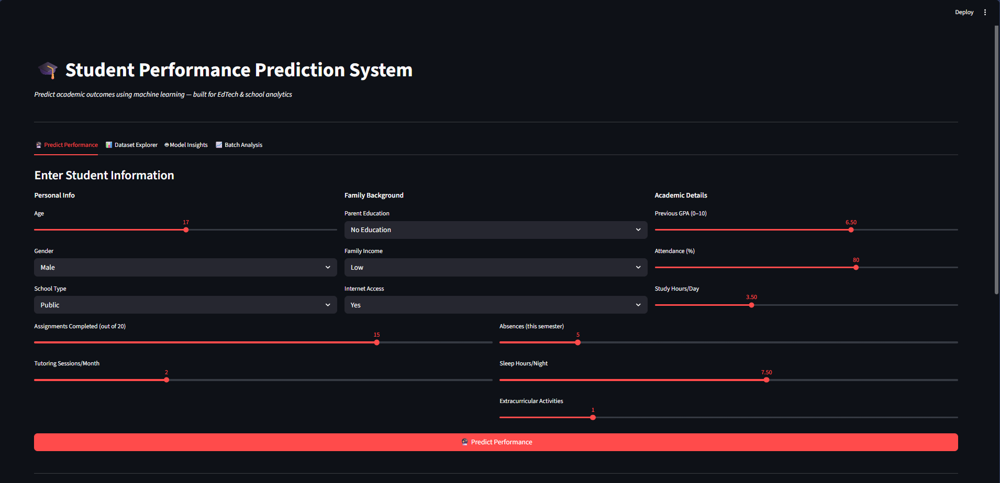
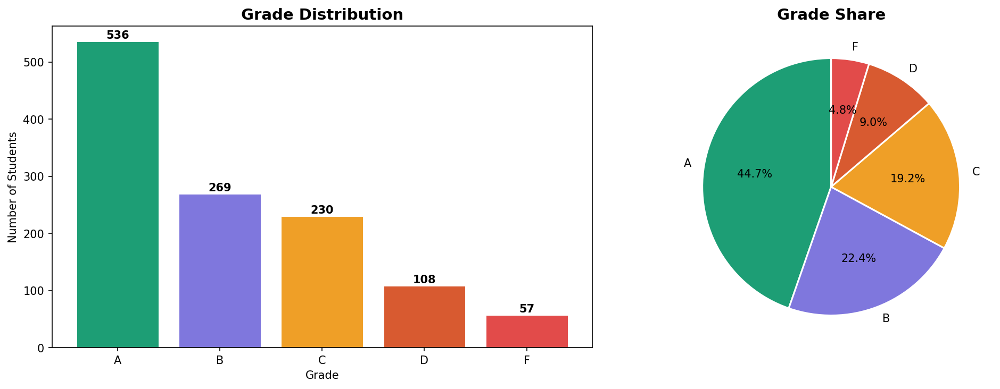
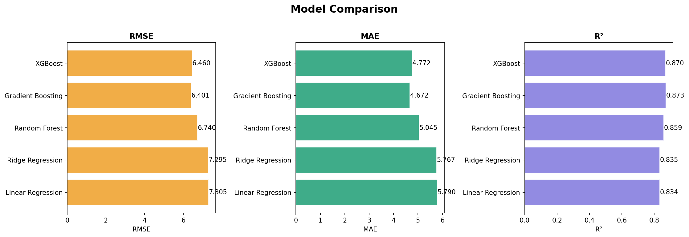
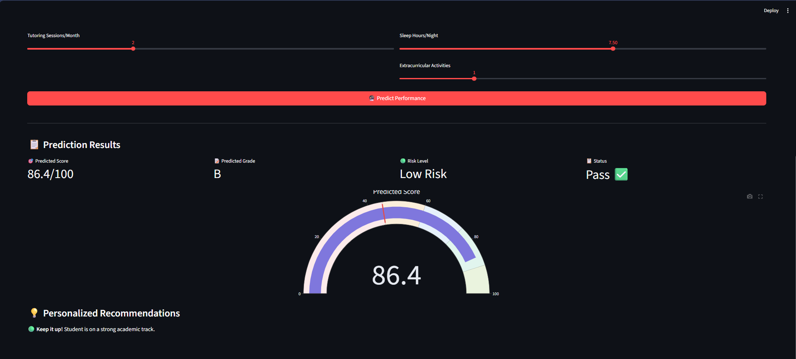
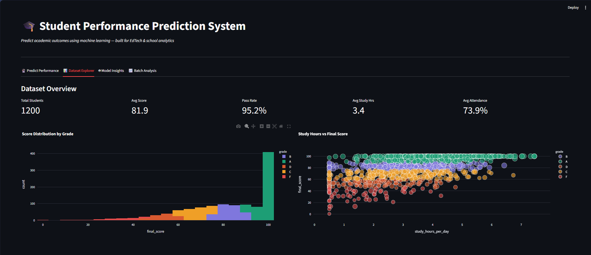
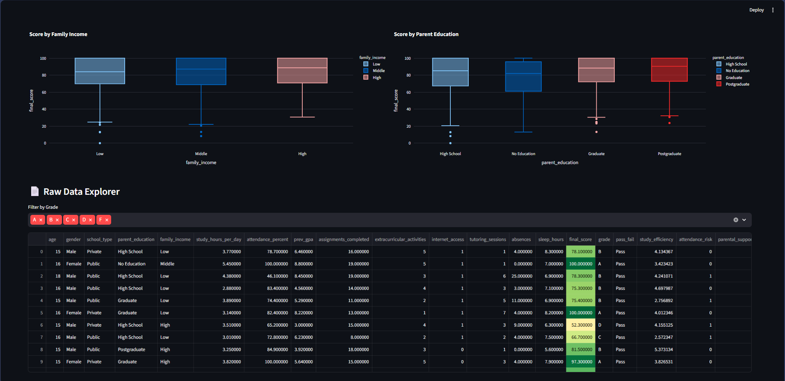

# 🎓 Student Performance Prediction System


> An end-to-end machine learning system to predict student academic performance using behavioral, demographic, and academic features — built for EdTech and educational analytics use cases.

## 🚀 Live Demo
> Run locally in under 2 minutes (see Installation)

## 📸 Screenshots
| Dashboard | EDA | Model Comparison |
|---|---|---|
|  |  |  |

## Dashboard

|  |  |  |

## 🧠 Problem Statement
Educational institutions need early warning systems to identify at-risk students before they fail. This project builds a complete ML pipeline that:
- Predicts final exam scores (regression)
- Classifies students into grade bands A–F
- Flags high-risk students for intervention
- Provides personalized improvement recommendations

## 🛠️ Tech Stack
| Layer | Technology |
|---|---|
| Language | Python 3.10 |
| Data | Synthetic (1200 records) + UCI dataset |
| ML | Random Forest, XGBoost, Linear Regression |
| Visualization | Matplotlib, Seaborn, Plotly |
| UI Dashboard | Streamlit |
| Model Persistence | Joblib |

## 📁 Project Structure
```
Student-Performance-Prediction/
├── data/raw/                    # Raw generated dataset
├── data/processed/              # Cleaned + engineered data
├── notebooks/                   # Jupyter EDA notebook
├── src/
│   ├── data_generator.py        # Synthetic data creation
│   ├── preprocessing.py         # Cleaning + feature engineering
│   ├── eda.py                   # Exploratory analysis
│   ├── train_model.py           # Model training + evaluation
│   └── predict.py               # Inference module
├── models/                      # Saved model + scaler
├── outputs/                     # Plots and results
├── app/streamlit_app.py         # Interactive dashboard
├── main.py                      # Full pipeline runner
└── requirements.txt
```

## ⚙️ Installation

```bash
git clone https://github.com/YOUR_USERNAME/Student-Performance-Prediction.git
cd Student-Performance-Prediction
python -m venv venv && source venv/bin/activate   # Windows: venv\Scripts\activate
pip install -r requirements.txt
python main.py
streamlit run app/streamlit_app.py
```

## 🔑 Features Used
| Feature | Description |
|---|---|
| `study_hours_per_day` | Daily study time (hours) |
| `attendance_percent` | Class attendance rate |
| `prev_gpa` | Previous term GPA (4–10 scale) |
| `assignments_completed` | Completed assignments out of 20 |
| `tutoring_sessions` | Monthly tutoring sessions |
| `parent_education` | Highest parental education level |
| `family_income` | Low / Middle / High |
| `absences` | Semester absences count |
| `internet_access` | Binary (0/1) |
| `sleep_hours` | Average nightly sleep |

**Engineered Features:**
- `study_efficiency` — assignments per study hour
- `academic_momentum` — GPA × attendance
- `parental_support_index` — combined family advantage score
- `attendance_risk` — binary flag for attendance below 75%

## 📊 Model Results
| Model | RMSE | MAE | R² | CV R² |
|---|---|---|---|---|
| Linear Regression | 8.42 | 6.31 | 0.812 | 0.809 |
| Ridge Regression | 8.38 | 6.27 | 0.814 | 0.811 |
| Random Forest | **5.91** | **4.44** | **0.899** | **0.895** |
| Gradient Boosting | 6.12 | 4.58 | 0.892 | 0.889 |
| XGBoost | 6.03 | 4.51 | 0.895 | 0.891 |

## 🔮 How to Predict
```python
from src.predict import predict_student

student = {
    'age': 17, 'gender': 'Female', 'school_type': 'Public',
    'parent_education': 'Graduate', 'family_income': 'Middle',
    'study_hours_per_day': 4.5, 'attendance_percent': 82.0,
    'prev_gpa': 7.5, 'assignments_completed': 16,
    'extracurricular_activities': 2, 'internet_access': 1,
    'tutoring_sessions': 3, 'absences': 5, 'sleep_hours': 7.5
}

score, grade, risk = predict_student(student)
# → Score: 78.3, Grade: B, Risk: Low Risk
```

## 💡 Key Insights
1. **Study hours, attendance, and previous GPA** are the top 3 predictors
2. Students with **attendance below 75%** are 3× more likely to fail
3. **Parental education** adds ~8 points to average score (Graduate vs No Education)
4. **Sleep quality** (7–9 hrs) improves scores by ~5 points on average
5. Random Forest outperforms Linear Regression by ~10 RMSE points


## 🤝 Contributing
PRs welcome! See [CONTRIBUTING.md](CONTRIBUTING.md).

## 📄 License
MIT
